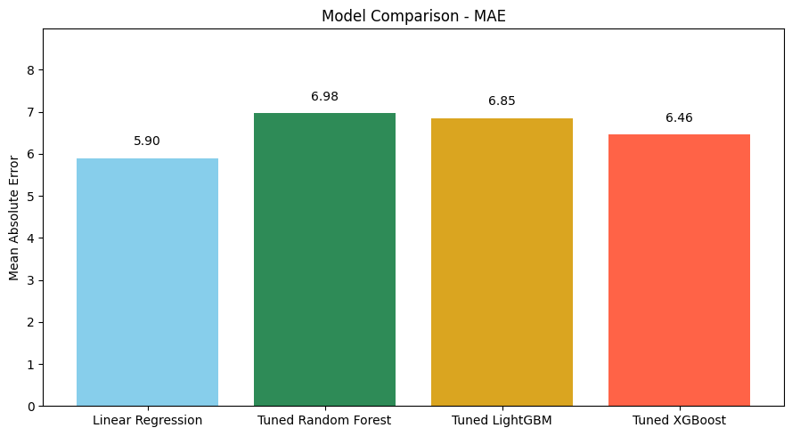

# Food Delivery Time Prediction (ETA)

Predicting order delivery time (minutes) from operational features such as distance, prep time, weather, traffic, and courier attributes. Built as a compact, explainable baseline with fair comparisons against tuned nonlinear models (RF, LightGBM, XGBoost, SVR, KNN). 

---

## 📌 Objectives

* **Business**: Provide reliable, human-readable ETAs to improve on-time delivery, staffing, batching, and routing decisions. 
* **Modeling**: Minimize **MAE (minutes)** on a hold-out test set; keep the solution simple unless a more complex model clearly wins.

---

## 📦 Dataset

* **Source**: Simulated food-delivery dataset (Kaggle).
* **Shape**: ~**1,000** rows, **9** columns.
* **Key features**: `Distance_km`, `Preparation_Time_min`, `Courier_Experience_yrs`, `Weather`, `Traffic_Level`, `Time_of_Day`, `Vehicle_Type`; target = `Delivery_Time_min`. 

> The data shows a strong linear relationship between **Distance**/**Prep Time** and delivery time. Categorical conditions (Weather/Traffic) add minutes, while experience slightly reduces time. 

---

## 🧭 Methodology (summary)

1. **EDA & Cleaning**

   * Drop duplicates; impute missing values

     * Categorical → **mode**
     * Numerical (`Courier_Experience_yrs`) → **median**
   * Quick visuals: boxplots & numeric correlation. 
2. **Feature Engineering**

   * **One-hot encoding** for `Weather`, `Traffic_Level`, `Time_of_Day`, `Vehicle_Type`.
   * (EDA-only) binned `Courier_Experience_yrs` for plots; not used in training. 
3. **Modeling**

   * Split: **80/20** train/test, `random_state=42`.
   * Metric: **MAE (minutes)**.
   * Models: Linear Regression, Ridge, Lasso, Decision Tree, Random Forest, LightGBM, XGBoost, plus **SVR** & **KNN** (with `StandardScaler` pipelines). 
4. **Hyperparameter Tuning**

   * **GridSearchCV (3-fold)** for RF/LGBM/XGB (and small grids for Ridge/Lasso/SVR/KNN when used).
   * Refit the **best estimator** on full train; evaluate once on test. 

---

## 🧪 Reproducibility

### Environment

```bash
python >= 3.9
pip install numpy pandas scikit-learn xgboost lightgbm matplotlib seaborn
```

### Run

```bash
# Open the notebook
jupyter notebook food-delivery-time-prediction.ipynb

```

> SVR/KNN are evaluated inside **pipelines** with `StandardScaler` to ensure fair scaling.

---

## 📈 Results

### MAE leaderboard (test set, ↓ better)

* **Linear Regression**: **5.90 min**  ← **Best**
* XGBoost (tuned): **6.46 min**
* LightGBM (tuned): **6.85 min**
* Random Forest (tuned): **6.98 min**
* Decision Tree (baseline): **11.12 min**
* SVR (scaled): **7.78 min**
* KNN (scaled): **8.57 min**  

**Linear family check**

* Linear Regression: **5.8992**
* Ridge: **5.9100**
* Lasso: **5.9147** (α via CV) → negligible difference; keep plain LR. 

**Tuning snapshots** (examples)

* **RandomForest** best params: `n_estimators=200, max_depth=None, min_samples_split=5, min_samples_leaf=2`
* **LightGBM** best params: `n_estimators=100, learning_rate=0.05, max_depth=10, num_leaves=31`
* **XGBoost** best params: `n_estimators=100, learning_rate=0.1, max_depth=3, subsample=0.8`  

**Why LR wins here**

* Strong near-linear signal from **Distance** and **Prep Time**; limited complex interactions in 1k rows means boosted/bagged trees bring minor gains at best.



---

## 🔍 Model Diagnostics (high level)

* **Actual vs Predicted** plots show good calibration around the mean and **under-prediction for very long deliveries** (rare tail).
* Consider adding interaction features (e.g., `Distance × Traffic`, `AdverseWeather` flags) or robust/quantile loss if tail accuracy is critical. 

---

## ✅ Final Choice

* **Production model**: **Linear Regression** (MAE ≈ **5.90 min**).
* Rationale: lowest test MAE, simple, fast, easy to explain; tuned nonlinear models did **not** exceed it on this dataset. 

---

## 💼 Business Recommendations

1. **Reduce distance**: micro-zoning/batching; dynamic delivery radius in peak/bad weather.
2. **Control prep time**: kitchen SLAs by cuisine/order size; throttle when store load spikes.
3. **Traffic & weather aware**: routing windows and ETA buffers; schedule extra couriers during adverse windows.
4. **Assignment rules**: prefer experienced couriers for long or adverse jobs.
5. **Customer comms**: show ETA **ranges** (± MAE), alert proactively if lateness predicted. 

---

## 🗺️ Roadmap / Next Steps

* **Features**: order size, cuisine type, store queue length, live traffic/rain intensity.
* **Modeling**: interaction terms; **Ridge/Lasso/Elastic Net** for stability; optional **Quantile/Huber** loss for tail control; SHAP for explainability.
* **Ops**: monitoring (MAE/P90 lateness), data drift checks, retrain cadence. 

---

## 📂 Repository Structure (suggested)

```
.
├─ data/                       # raw/processed (exclude large files from git)
├─ notebooks/
│  └─ food-delivery-time-prediction.ipynb
├─ src/
│  ├─ features.py              # encoding, pipelines
│  ├─ models.py                # model builders, grids
│  └─ evaluate.py              # metrics, plots
├─ reports/
│  └─ Data Science Food Delivery Time Prediction.pdf
├─ README.md
└─ requirements.txt
```

---

## 🙏 Acknowledgments

* Kaggle dataset author(s) for the simulated delivery data.
* Slides/notes compiled into `Data Science Food Delivery Time Prediction.pdf`. 

---
